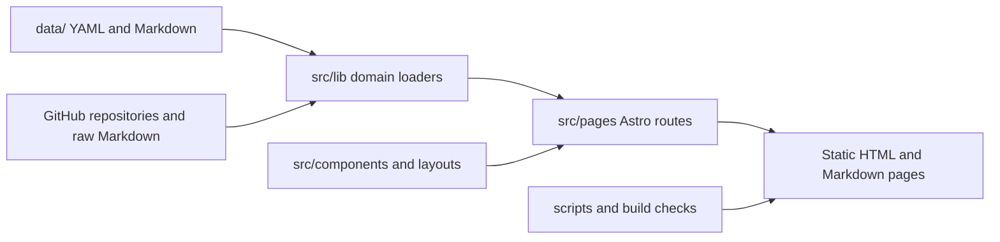

# Technology Documentation

This `docs/` tree is the repository-facing documentation surface that the Technology site
will scan and publish in the Documentation section.

## Repository Overview

The `technology` repository is a static Astro site that publishes multiple knowledge
surfaces from a single data root. At a macro level, the project is composed of page
templates, domain loaders, shared rendering utilities, and curated data files that are
expanded into static HTML routes and Markdown twins.

## Recommended Reading Order

If you need the short version of the repository direction, start here:

1. [Architecture Current Strategy](./architecture/current-strategy.md)
2. [Architecture System Overview](./architecture/system-overview.md)
3. [Configuration Data Sources and Build Composition](./configuration/data-sources-and-build.md)

## Tech Radar

The Tech Radar surface captures the approved technology inventory, operating posture,
and lifecycle recommendation for tools, platforms, and practices that teams may adopt.

- Route: [`/tech-radar/`](/tech-radar/)
- Data source: `data/tech-radar.yaml`
- Implementation: `src/lib/tech-radar.ts`, `src/pages/tech-radar.*`

## ADRs

The ADR catalog turns repository-scanned architecture decision records into a searchable
library with normalized metadata, repository provenance, and route-level publication.

- Route: [`/adrs/`](/adrs/)
- Data source: `data/adr-repositories.yaml`
- Implementation: `src/lib/adrs.ts`, `src/pages/adrs.*`

## Skills

The Skills area in AI SDLC documents the approved skill repositories, installation
sources, and evaluation-backed records used to understand reusable agent capabilities.

- Route: [`/ai-sdlc/skills/`](/ai-sdlc/skills/)
- Data source: `data/skills-repositories.yaml`, `data/skill-evaluations.yaml`
- Implementation: `src/lib/skills-repositories.ts`, `src/lib/skill-evaluations.ts`, `src/pages/ai-sdlc/skills/**`

## Metrics

The Metrics area in AI SDLC explains how adoption, usage, throughput, and quality signals
should be read so teams can evaluate whether AI-assisted delivery is producing real value.

- Route: [`/ai-sdlc/metrics/`](/ai-sdlc/metrics/)
- Data source: `data/ai-sdlc.yaml`
- Implementation: `src/lib/ai-sdlc.ts`, `src/lib/ai-metrics-demo.ts`, `src/pages/ai-sdlc/[slug].*`

## Harness Tools

The Harness Tools subsection describes the agent tooling layer used during execution,
including tool roles, operating expectations, and how those tools fit inside the SDLC.

- Route: [`/ai-sdlc/harness-tools/`](/ai-sdlc/harness-tools/)
- Data source: `data/ai-sdlc.yaml`
- Implementation: `src/lib/ai-sdlc.ts`, `src/pages/ai-sdlc/[slug].*`

## Cloud Enablement

The Cloud Enablement surface compares provider capabilities, operating constraints, and
service-level guidance so teams can reason about platform fit from one normalized model.

- Route: [`/cloud-enablement/`](/cloud-enablement/)
- Data source: `data/cloud-enablement.yaml`
- Implementation: `src/lib/cloud-enablement.ts`, `src/pages/cloud-enablement.*`

## Communities

The Communities area tracks internal and external groups that shape technical practice,
shared standards, and cross-team knowledge exchange.

- Route: [`/communities/`](/communities/)
- Data source: `data/tech-communities.yaml`
- Implementation: `src/lib/tech-communities.ts`, `src/pages/communities.*`

## Documentation

The Documentation surface scans repository-backed Markdown trees, rewrites internal links,
and publishes them as folder-aware reading experiences with HTML and Markdown twins.

- Route: [`/documents/`](/documents/)
- Data source: `data/document-repositories.yaml`
- Implementation: `src/lib/documents.ts`, `src/pages/documents.*`

## Use Cases

The Use Cases section documents example workflows for consuming the site as an operational
Markdown surface, including code-assistant-oriented patterns.

- Section docs: [`./use-cases/README.md`](./use-cases/README.md)
- Example focus: Markdown-first navigation, Codex, Claude Code, and GitHub Copilot Chat
