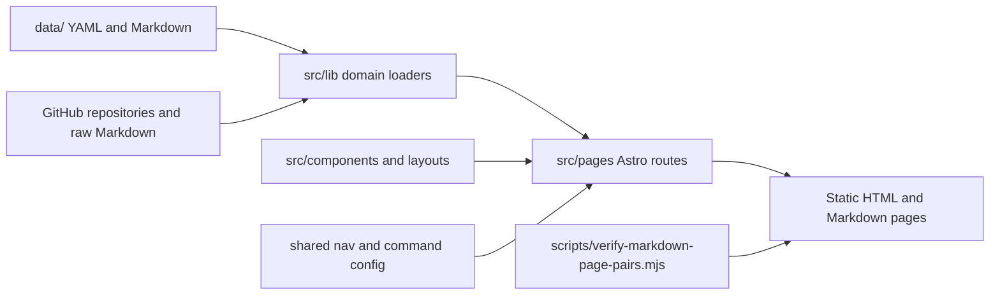
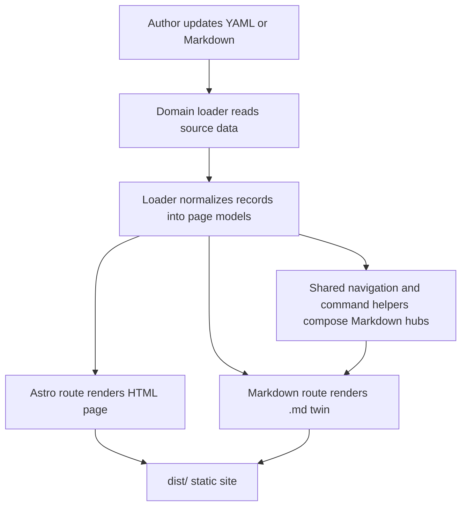

# Technology Repository System Overview

This repository is a static Astro site that publishes multiple knowledge surfaces from a
single data root. At a macro level, the project is composed of page templates, domain
loaders, shared rendering utilities, and curated data files that are expanded into
HTML routes and Markdown route twins.

## Level-Zero View

The repository has five macro building blocks:

1. `src/pages/` defines the public routes.
2. `src/lib/` loads, normalizes, and shapes the domain data for each page family.
3. `src/components/` and `src/layouts/` provide the shared page chrome.
4. `data/` stores the authoritative structured content and scan configuration.
5. `scripts/` and Astro build steps validate route parity, generated Markdown reachability, and the static site.

## Repository Map

### `src/pages/`

The route layer is grouped by major content surfaces:

- `tech-radar.*`
- `adrs.*`
- `documents.*`
- `ai-sdlc.*`
- `cloud-enablement.*`
- `models.*`
- `communities.*`
- `index.*`

Each top-level `.astro` page has a matching `.md.ts` route so the site can expose the same
content as rendered HTML and Markdown.

### `src/lib/`

The library layer is where the page models are composed:

- `documents.ts` scans repositories, resolves Markdown pages, rewrites links, and builds the
  documentation tree.
- `adrs.ts`, `tech-radar.ts`, `ai-sdlc.ts`, `cloud-enablement.ts`, and `models.ts` do the same kind of
  composition for their own surfaces.
- `dual-format.ts` helps keep HTML and Markdown URLs aligned.
- `home-markdown.ts` builds the Markdown landing page from shared navigation, terminal command
  configuration, and discovered support routes.
- `standard-page-nav.ts` is the shared source of truth for the primary section navigation.
- `site-url.ts` centralizes base-path-aware URL generation.

### `src/components/` and `src/layouts/`

These files provide the stable shell:

- `BaseLayout` wraps the page document.
- `StandardPageHeader` provides the top navigation and search surface.
- `DocumentsTree` renders the nested documentation navigation for repository-backed docs.

### `data/`

`data/` is the single structured content root for the repository. It contains:

- page-driving YAML such as `tech-radar.yaml`, `models.yaml`, and `document-repositories.yaml`
- interaction-driving YAML such as `terminal-commands.yaml`, which also feeds the Markdown landing
  page command list
- spike inputs and route source material under `data/spikes/**`

### `scripts/`

The scripts directory enforces repo invariants:

- `verify-markdown-page-pairs.mjs` checks every page family for HTML and Markdown parity and can
  audit the generated Markdown graph in `dist/`
- `install-git-hooks.mjs` prepares local workflow guardrails

## Composition Model

The site does not rely on a CMS. It builds pages from a mix of checked-in content and
repository-derived content.

## Why The Project Is Structured This Way

This structure keeps the repository opinionated in a few important ways:

- content remains inspectable in Git
- data files stay separate from route templates
- each domain page can evolve independently without fragmenting the site shell
- generated Markdown mirrors the HTML routes so content can be exported or consumed by agents
- Markdown navigation is derived from shared sources where possible so route additions do not
  depend on hand-maintained landing-page lists

## Practical Modification Boundaries

If you need to change the site, use this mental model:

- edit `data/` when the source facts or inventory change
- edit `src/lib/` when the shaping logic changes
- edit `src/pages/` when the information architecture or route presentation changes
- edit `src/components/` and `src/styles/` when the shared UI language changes
