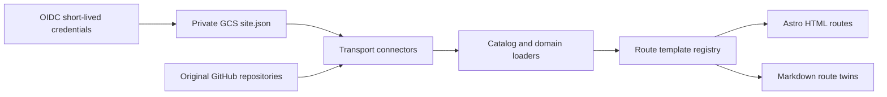

# Technology Repository System Overview

The Astro build composes private remote configuration and original GitHub content into public static HTML
and Markdown routes.

## Boundaries

- `src/lib/connectors.ts`: transport for `gs://` and `https://` sources.
- `src/lib/site-catalog.ts`: cached catalog, route registry, navigation groups, and named datasets.
- `src/lib/*`: domain normalization and original-source scanners.
- `src/components/templates/`: reusable route templates.
- `src/pages/[...route].astro` and `[...route].md.ts`: generic catalog route pair.
- specialized files under `src/pages/`: custom interaction templates.
- `scripts/verify-markdown-page-pairs.mjs`: source parity and generated Markdown graph checks.

There is no repository data directory and no local-content connector. A filesystem path must never be a
build-data fallback.

## Extension Rules

- New records: update the external dataset.
- New directory-style page: add a dataset and a `template: "catalog"` route.
- New connector: add one protocol implementation to `connectors.ts`.
- New interaction model: add one template identifier and its HTML/Markdown renderer.
- New metadata derivation: change the relevant domain loader, not the transport layer.
