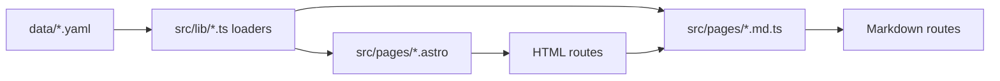
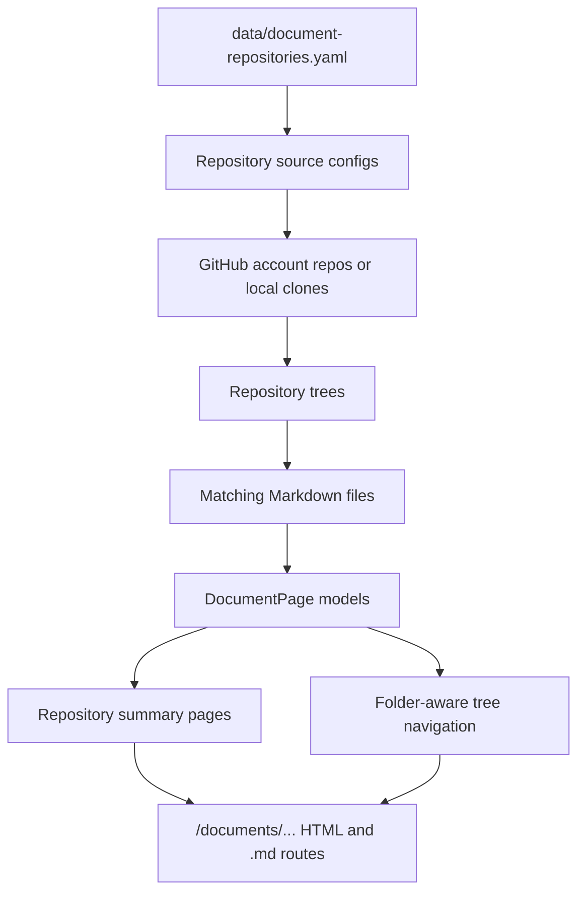

# Data Sources And Build Composition

The configuration model for this repository is centered on checked-in YAML files under
`data/`. Each major page family reads a dedicated source file and transforms that source
into a page model during `astro build`.

## High-Value Configuration Files

The following files are the most important for day-to-day maintenance:

- `data/document-repositories.yaml`: repository scanning rules for documentation pages
- `data/tech-radar.yaml`: technology inventory and radar metadata
- `data/products.yaml`: products referenced across the site
- `data/models.yaml`: model catalog used by AI-facing content
- `data/ai-communities.yaml` and `data/tech-communities.yaml`: community inventories
- `data/skills-repositories.yaml` and `data/skill-evaluations.yaml`: skills catalog sources
- `data/terminal-commands.yaml`: command definitions shown by the fake terminal

## Configuration To Route Flow

The Markdown landing page is composed from shared sources instead of a hand-maintained route list:

- `data/terminal-commands.yaml` provides the visible terminal command inventory
- `src/lib/standard-page-nav.ts` provides the primary section navigation
- `src/pages/spikes/**/*.md.ts` is scanned for static Markdown support routes that should appear
  in the landing-page support section

## How Documentation Scanning Works

The `documents` surface is the most dynamic configuration-driven page family in the
repository.

### Source Of Truth

`data/document-repositories.yaml` defines:

- which GitHub account or repositories should be scanned
- which repository name filters are allowed
- which document rules apply inside each repository
- which folder domains and path patterns are publishable

### Resolution Pipeline

During build, `src/lib/documents.ts` performs these steps:

1. load the repository scan configuration from `data/document-repositories.yaml`
2. expand repository candidates from GitHub or local workspace fallbacks
3. fetch repository trees and match Markdown files against configured rules
4. read Markdown sources, frontmatter, and commit dates
5. normalize each file into a `DocumentPage`
6. collapse folder landing pages through `README.md` or `index.md`
7. emit repository landing pages, folder pages, and document pages

## External Sources Used During Build

The build can compose pages from three kinds of inputs:

### Checked-In Local Data

This is the default and safest source:

- YAML and Markdown under `data/`
- Markdown under `docs/`
- content collections under `src/content/`

### GitHub API Metadata

Some loaders query GitHub for repository metadata or repository trees. For example,
`documents.ts` can call:

- repository listing endpoints
- Git trees endpoints
- commits endpoints for latest file dates

The loader keeps in-memory caches during the build to avoid repeated requests.

### Local Workspace Fallbacks

When GitHub rate limits or denies access, some loaders fall back to local sibling clones.
That is how the documentation scanner can still resolve repository-backed pages while
working offline or under API restrictions.

## Update Strategy By Change Type

Use this update model when maintaining the site:

- update `data/*.yaml` when inventories or classifications change
- update `docs/**/*.md` when repository documentation should appear in the Documentation section
- update `src/lib/*.ts` when composition logic, URL rewriting, or derived metadata changes
- update `src/pages/*.astro` when information architecture or page layout changes
- keep `src/pages/models.astro` and `src/pages/models.md.ts` aligned when the model catalog surface changes

## Build Guardrails

The build has a few important safety constraints:

- `npm run check:markdown-pages` enforces HTML and Markdown route parity
- `npm run check:markdown-pages:dist` audits the generated `dist/**/*.md` graph, starting at
  `/index.md`, and fails on broken internal `.md` links or unreachable generated Markdown pages
- `npm run build` runs the parity check, Astro build, and the post-build Markdown graph audit
- documentation routes are generated statically, so scan results are frozen at build time

## Markdown Navigation Model

The repository treats Markdown output as a navigable surface rather than an export-only format.

That means the generation layer is responsible for two guarantees:

1. every HTML page has a Markdown sibling route
2. the generated Markdown graph is internally traversable from `/index.md`

The second guarantee is validated against built output instead of inferred from source files
alone, which catches issues such as:

- index pages that list sections as plain text instead of links
- generated detail pages without a Markdown return path
- rewritten relative links that resolve to missing `.md` outputs

## Operational Consequences

This configuration approach gives the project a few useful properties:

- the site remains inspectable and reproducible from Git state
- configuration changes are reviewable as plain diffs
- repository-backed documentation can be published without a separate CMS
- the same content can be browsed as HTML or consumed as Markdown
