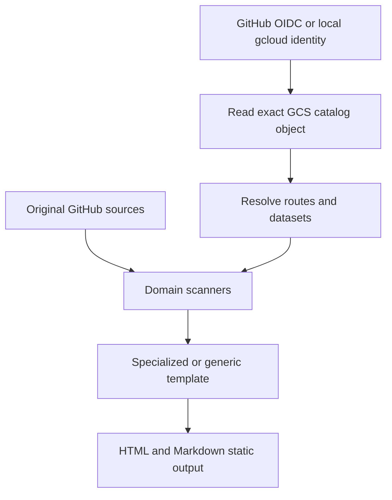

# Data Sources and Build Composition

## Source Priority

1. Query the original source when it offers a stable build-time interface. ADRs, documents, and skills use
   GitHub repository trees and raw Markdown this way.
2. Use a governed JSON dataset or snapshot in the private GCS catalog when direct source access is not
   suitable.
3. Do not add local data files or filesystem fallbacks.

The default catalog is `gs://limited-502918-cheap-gcs/technology/site.json`. Override it with
`TECHNOLOGY_SITE_CATALOG_URI`; supported values are `gs://` and `https://` URLs.

## Build Flow

GitHub Actions requests a short-lived Google identity, then `astro check` and `astro build` read the exact
object directly. The workflow does not download an archive or materialize a `data/` directory.

## Contracts

- Connector contract: `readSourceText(uri)` and `readSourceJson<T>(uri)`.
- Catalog contract: `schemaVersion`, `navigationGroups`, `routes`, and `datasets`.
- Route contract: `id`, `path`, `template`, optional navigation metadata, `dataset`, `intro`, and `source`.
- Generic catalog projection: collection plus title, summary, eyebrow, tags, link, and metadata field names.

## Validation

- `npm run check` validates TypeScript, Astro, and HTML/Markdown source parity.
- `npm run build` also validates the generated Markdown graph.
- A build without valid GCS credentials must fail instead of silently using stale local data.
